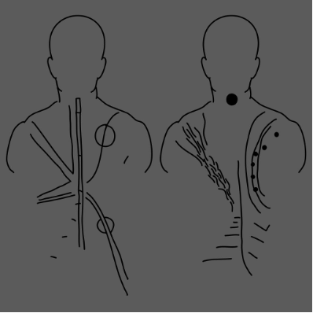

+++
title = "Pleased to Meet You"
date = "2022-08-12"
publishdate = "2022-08-03"
slug = "pleased-to-meet-you"
draft = "false"
+++

<!--
ideas - talk about creating this song in isolation. 

-->

I produced this song when I contracted Covid for the very first time earlier this year. 

I was isolated in my room, listening to Burial’s *Untrue*. I also dug deeper into B12’s *Time Tourist*, and ate plain food while rewatching *Cowboy Bebop*, this time with English subtitles. When I felt less fatigued, I continued reading *When the Body Says No* by Gabor Mate.

I really appreciated the stillness. I had an unusual level of focus, resulting from fewer distractions. I finally understood the essence of *Digital Minimalism* by Cal Newport and what it meant for me: a tired and unfocused mind cannot create, or one that is trying to achieve too many things.

For the first time in a long while, I understood what was in my control. My mind wondered, and I felt at ease going from place to place. It led to a few life decisions which I’ve mainly stuck too.

\-

*Friday August 12th, 2022.*

[*musings*]().

