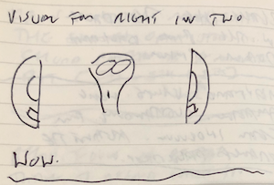

+++
title = "Be Patient"
date = "2022-08-03"
publishdate = "2022-08-03"
slug = "be-patient"
draft = "false"
+++

## Tool. O2 Arena, London. Monday 9th – Tuesday 10th May 2022.

Sat top tier to the left on Monday. Sat dead centre lower tier on Tuesday.

The moment when *Fear Inoculum* started was incredibly emotional. The moment when Maynard started singing was spine tingling. The sunset lighting, a piercing orange sun with a volcanic energy, was beautiful.

I can’t believe I saw them play *The Grudge*, *Mantra* and *The Patient*…in a row. *The Patient* was the first Tool song I really liked.

Maynard absolutely nailed *I must persuade you another way* during *Pushit*… on both nights.

The visual for *Right in Two* involved a face, reminiscent of the cover of *In the Hall of the Crimson King* by *King Crimson*, slowly splitting in two throughout the song. What emerged was another face with cat like features, so imposing like an Egyptian Pharoah. I felt it’s ferocity as it was staring at me.

The ticker tape that fell during *Culling Voices* looked like glitter. I wish all rain looked like that, perhaps I would prefer it.

It was so unusual to be at a gig where the audience was attentive, there was barely any phone use (and it was enforced, my friend said someone on the second night was chucked out) and that no one sang along to the words. Every song took you in like a trance, and the punishing volume meant you were taken to another place. It’s like Maynard says comments during *Pushit* on *Salival* live album, they really do want to take you to a different place.

Lighting on *The Patient*. The bit when the white strobe behind Maynard, who was stood on a platform stage right, lit up as he sang the chorus. He made a gorgeous silhouette.

Maynard made me laugh on several occasions. He called Danny Carey *old* on his birthday. He said they were going to France and everyone booed. He responded with…*right?* When he announced that he was tired, he described that he was 58, wanting to be 48, pretending to be 28. I like how he condescendingly told people they could film *Invincible* – the last song of the set – stating that he knew people were desperate to do that. And when someone wasn’t adhering to not using flash, he said he would do something *unpleasant in their mouth*. Seemingly displeased with the response to when he exclaimed London near the beginning of the set, he questioned the reaction, responding with, this is not Liverpool, London? He also kept leaving the stage during lengthy jams – who does that?

It was special to see an elite level band who are unashamedly themselves, playing at a virtuoso level at their age. I hope to have that level of function when I’m 58 – this is something I aspire too.

*Pneuma* lighting. The red magma backdrop for the chorus. Oof.

He did the scream during *The Grudge*. AHHHHHHHHHHHHHHHHH.

They played so many unexpected songs. *Ticks and Leeches*. *Hooker with a Penis*, *The Grudge*, *Mantra*, *The Patient*, *Right In Two*, *Sober*, *Undertow*, *Opiate*, *The Pot*. The song selection really complimented the new album.

The band radiated energy even though they don’t move a lot. I really like Justin Chancellor’s quarter mosh, like he’s pushing and pulling with an invisible force. Danny Carey hits the drums so hard, but with incredible level of precision. Adam Jones right hand has the energy of a punch from a heavyweight boxer. Maynard is a spectral presence stood behind the band.

The band setup on stage is so good. The space in the middle being vacated means that the energy on stage is distributed in a different way. It invites the audience to focus on different areas of the stage. It draws energy away from an obvious focal point (the singer) and distributes that among the members, which strengthens the whole. This is especially apparent when Maynard ducks out when he’s not singing. It’s quite a democratic way of being on stage. If I was ever lead singer of a band, I would duck away from the centre and stand deeper on stage. Let the music do the talking. Also, because the video screens do not show the band members at all, it also removes the focus away from them so you can experience the whole thing.

*Culling Voices*. It was a lovely touch when they all sat on stools playing. Danny Carey playing guitar, cradling like he would a small child. Was a nice touch at the end of the second night when he brought his kids on stage. 

Maynard's vocal were the perfect mix of reverberated and clear. Distant and present. His pitch, especially in high registers, was angelic.

\-

*Friday August 19th, 2022.*

[*musings*]().