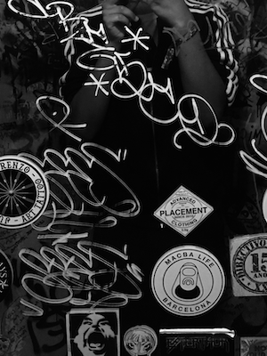

+++
title = "Golden Hair: Primavera Sound 2018"
date = "2022-09-02"
publishdate = "2022-09-02"
slug = "golden-hair-primavera-sound-2018"
draft = "false"
credits = ""
+++

## Primavera Sound, Barcelona. Thursday 31st May - Saturday 2nd June 2018.

"*Lean out of the window, golden hair.*" 

– Syd Barret.

*Barcelona*. On my lonesome.

*Warpaint*. Front right segment. Up on a slight hill. Second act of the day. They begin with *Intro*, followed swiftly by *Keep It Healthy*. It’s deft, light and inviting. "*In my dreams we are awake*", sing Emily Kokal and Thereas Wayman in haunting harmony. I still revisit the [full set](https://youtu.be/b5BSfZOWb1k) from time to time.

*Björk*. Front right segment. Back against the barrier. The setup was more than intriguing. Everyone wore white. Dancing flutists. An electric drum kit. *Arisen My Senses* really caught me. Heavy strobe and heavenly vocals.

*Vince Staples*. Ten rows from the front. Central. Intro tape simmered with the background bed to *Get the Fuck off My Dick*, which he’d just released. “Primavera”, he stated factually, entering his arena. Dressed in Kevlar in front of several dimly lit TVs, Vince’s outline prowled the stage.

*Mogwai*. In front of the sound desk. Back against the barrier. I called my brother during the *Hawk Is Howling*. The track becomes stuck in loop. Reminds me of dreams when I can’t stand up. The release is how I imagine it feels to finally make it back on my feet. 

*Tyler, the Creator*. Front right segment. Five rows from the front. I had watched him shout his way through his discography on dozens of YouTube videos. They somehow feel like false memories – like I had experienced him before, even though I wasn’t there. Tyler was wearing a high vis jacket and shorts. His hair was *cheetah-esque*. The stage had three risers at the back, with a screen displaying a pseudo tree-of-life. I was taken aback by the progress Tyler had made as a live performer. I was really proud of him. 

*Slowdive*. In front of the sound desk. Back against the barrier. Central. I became obsessed with *Machine Gun* from their *Souvlaki* record. The band were also their own roadies – I remember the crowd warmly applauding the band as they set themselves up. Fully welled up during their cover of Syd Barret’s *Golden Hair*, the last track of the set. Rachel Goswell’s icy vocal intro gave way to a colourful abyss. I was lifted and ceded all control. I let myself be vulnerable. 

*Gaika*. Club stage. Front row. Perhaps I was recommended by a friend, or I was persuaded by his bio, or that he *releases on Warp*. Performing in the round on a small table, oozing with gear and cables. Wearing sunglasses and a blazer *sans tee*, *Gaika* stepped onto the table, fashioned a crevice between the cables, and preceded to go in hard on *Basic Volume*. I was energised. 

*Skepta*. Front right segment. Ten rows from the front. Decked out in all whites, perhaps he was one of the troupe of flutists performing with Björk. Only there because the Migos *missed their flight*. 3am after A$AP Rocky. *Detox* is simultaneously menacing and pleasant – makes me chuckle. *Skepta* raps like it really matters – *don’t sweat the technique*.

Recommended tracks: <!--Spotify Link-->

* Björk – Arisen My Senses
* Gaika – Basic Volume
* Mogwai – The Hawk is Howling
* Slowdive – Machine Gun
* Skepta – Detox
* Tyler, the Creator – Garden Shed
* Vince Staples - Rain Come Down
* Warpaint – Keep it Healthy

