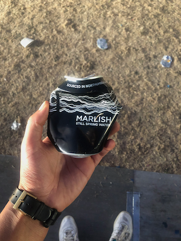

+++
title = "Music Non-Stop: Field Day 2022"
date = "2022-08-26"
publishdate = "2022-08-26"
slug = "music-non-stop-field-day-2022"
draft = "false"
credits = ""
+++

## Field Day, London. Saturday 20th August 2022.

2:50pm. Victoria Park. On my lonesome.

2.55pm. 6Music Stage. Mary Anne Hobbs. Old hands, aviators, *Autobahn* t-shirt. New Order’s *Blue Monday*. *Now I stand here waiting*…

3:02pm. West Stage. Underneath the sun. Artwork b2b CC:DISCO! Are Hawaiian shirts in vogue or did they never go away?

3:13pm. Bros ask me if this is the East Stage. I confirm that it’s not and point them in the other direction.

3:21pm. I feel a little liquid sprinkle the back of my calf.

3:35pm. A gentleman kissing all his bros on the neck. So tender and with utmost care.

3:45pm. Said gentleman prepares his little spoon. Spatial awareness is low.

3:49pm. Artwork and a sound technician are debating vigorously.

3:50pm. Bros pile into my general zone and I’m forced out. <!--Invading the space.--> Chill.

3.58pm. First pit-stop. Guy slots in next to me and touches my toes. Seriously have we forgotten about spatial awareness?

4:03pm. North stage. Indoor tent. Tourist. Back against the barrier, in front of the sound desk.

4.05pm. Second person to ask me directions to the East Stage. Am I that approachable?

4:06pm. Third person asking me if this is the North Stage. Receive a fist bump for confirmation.

4:25pm. Lots of talking. Not enough paying attention.

4:29pm. Tourist deserves a better audience than this. His music is so delicate and ethereal, and his ambient interludes are being drowned out by the chatter. Fourth person to ask me for directions to the East Stage.

4:30pm. Fifth person to ask me if this is the North Stage.

4:35pm. A gentleman is wearing a t-shirt with the storyline to *One Who Flew Over the Cuckoo’s Nest*.

4:48pm. Several people have pleaded with the sound desk to turn it up because too many people are talking.

4:51pm. Leave the North Stage. The Firestone Stage emits a remix of Rihanna’s *We Found Love*.

4:53pm. Walk past the BMW Stage to a barrage of noise. Notice it faces the East Stage, which is audible but someway in the distance. Standing a few steps from the BMW stage, I can hear both stages simultaneously. The folk on the BMW stage have *no chance* today.

5:14pm. Vegan Burger. Solid. Subtle sauce. Performer on the East Stage suffers from severe track skipping. BMW Stage is dormant and all is well. Tree trunk provides suitable seating position.

5:19pm. T-Shirt slogan: *I was hoping for a cooler death*.

5:23pm. Asked at the bar if they sold soda. Only sold canned water for £2.50. Soda for mixing only. I bought one cause I’m a sucker. In Balham, I once paid £5 for an orange juice poured out of carton you’d find in Costco.

5:31pm. North Stage. Squarepusher. Back against the barrier, in front of the sound desk. 

5:43pm. Squarepusher seems to combine Aphex Twin, bleep, chords that echo Miles Davis’s *In a Silent Way* and math rock.

6:00pm. I’m guessing this is what a car journey with Vaughan from JG Ballard’s *Crash* would sound like. Exhilarating, death-defying, risqué.

6:06pm. Sixth person to ask what stage this is, and for directions to the East Stage.

6:13pm. Squarepusher is glued to his equipment. He’s created a flow of murderous energy between him and his machines, drawing every last drop of energy.

6:15pm. Older man, fully tattooed and dressed in red, starts rolling on the floor. He becomes stationary on his back, and he’s exposed. His friend gently rolls his foot on his nether regions. He stands up gingerly, and his friend pats the scorched grass off his back.

6:39pm. Obtain a plant-based cookie dough brownie and chew it over Rebekah’s hard as nails set on the 6Music Stage. Purchase another canned water because I’m a sucker.

6:45pm. West Stage. Carl Craig b2b Moodymann. Back against the barrier to right of the sound desk. Notice it’s Carl Craig *sans* Moodymann. Carl is wearing a top hat, a lovely light printed cardigan, black tee, two beaded necklaces that appear to interlock, and tinted sunglasses.

6:56pm. Moodymann tags in. Grey hoody, white round glasses, towel draped over his right shoulder. Through his grey face mask, he asks, “Hey, how you feeling out there?”

7:01pm. Moodymann collects data on the age of his audience. A pleasing number of hands go up in response to, "where my *50s* at?"

7:13pm. Carl Craig back on duty, plays Cybotron’s *Clear*. Moodymann goes wild. 

7:15pm. Someone asks me what I’m writing. They assumed I was taking setlist notes for *PRS*.

7:17pm. An older gentleman hands out cans of water to his pals on a tray embossed with the *Red-Stripe* logo.

7:20pm. Carl Craig and Moodymann end with Yes’s *Owner of Lonely Heart*. Moodymann suggests ominously, “you know what time it is...”

7:23pm. Second pit-stop. Among the beer cans lays someone’s bucket hat. Man reflects that he lost his sunglasses in similar circumstances. He reflects that they were only £40, not £100, so it wasn’t a disaster.

7:30pm. Several men erect Kraftwerk’s giant screen.

7:43pm. Kraftwerk’s workstations personify precision engineering. They appear to have identical dimensions and distances between them.

7:56pm. I can hear eerie ambient sounds. The screen appears to be undergoing an initialising sequence, with four geometric blobs on screen. 

8:00pm-9:10pm. West Stage. Kraftwerk. Front left, ten rows from the front. Crisp, clean and concise. The graphics are hi-fi in detail but have a warm lo-fi aesthetic. The shadows of the band on their workstations become part of each scene. Combined with the 3D glasses, I experience some wonderful moments. *The Main Machine* models reaching out to the audience. A spaceship venturing its way to Field Day. Riding on the *Autobahn*. A film noir cycling montage during *Tour de France*. Vocals are extraordinary throughout. The vocoder on *The Main Machine* chorus is a delight. There’s a dispassionate and functional quality to Ralf Hütter’s vocals, but this allows their messages to cut through, many of which have come to pass:

*I call this number / for a data date.*

*Business, numbers / money, people.*

*We are programmed just to do / anything you want us to.*

*Man Machine / pseudo-human being.*

*Music Non-Stop* finishes with a visual of musical notes drifting through the ether. Each band member leaves the stage, taking a bow and the acclaim. "*Goodbye. Auf wiedersehen.*" The last words from Ralf Hütter, the traditional Kraftwerk ending. I shed a tear. 

9:20pm-9.50pm. Purchase chips. Sit on a bench. Speak with an older woman who’s lost her friends. She asks me, “*what are you looking for?* ” She takes a sip from my water bottle and puts it in her bag. Subsequently, I find £20 on the floor and depart.

9:54pm. On my way out, three ladies sneak past security. After a five second delay, security begin the chase. I don’t stay for the ending.

9:55pm. Walking home next to the site border. Dad with his daughter on his shoulders, peering through a gap in the fence to watch *The Chemical Brothers*.

