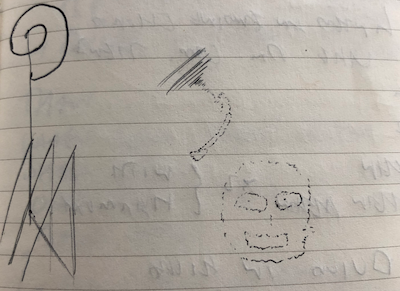

+++
title = "Where Did All My Fivers Go?"
date = "2022-09-09"
publishdate = "2022-09-09"
slug = "where-did-all-my-fivers-go"
draft = "true"
credits = ""
+++

> "Over thinking, over analyzing separates the body from the mind / 
> Withering my intuition leaving opportunities behind."
>
> *Tool*

*Where did all my fivers go?* Bigg Market. Floritas. Beeju. The Gate. Salt and Pepper. Aspers. Digital. Gotham. Venue. Players. Skittles. CCTV. Tiger. Popworld. World Headquarters. Sinners. Riverside. Chase. Cosmic Ballroom. Propaganda. Bar 42. Basement. Hancock. Sam Jack's.

*Run*. I ran away from nights out quite often. I remember queuing for Digital. It was a friend’s birthday. As I ventured towards the front, my mind *compelled* me to leave. I was on rails, and the destination was home.

*Skulk away from persuasion*. I would always be the last to leave pre-drinks. I actually enjoyed them, but I greatly feared what came next. When it was time to leave, I would always hang back. That way I could make a swift exit home without *justifying* it. People wanted me around, but I simply didn’t want to be where they were going.

*Santa is coming home*. I once left a fancy dress party. I believe someone asked me to stay, but my mind was already made up. I deposited my Santa costume in a bin outside the club, exposing the t-shirt and short combo underneath. Switching to *athlete mode*, I ran up Northumberland Street and down Jesmond Road. I always enjoyed running back – I wasn’t good at going out but I was good at running.

*Riverside*. I stood on the balcony, overlooking the dancefloor, speaking to no one.  

*Where is <!--Mark--> Home*? I must have confused a lot of people. I tried to explain why…perhaps once properly. I lacked the vocabulary. I recall confiding in a friend of mine about my dislike of *going out*. Now I realise my definition of going out was skewed towards a particular type of going out. Other ways of going out existed but like the *Age of Empires* I had yet to discover other lands. I was stuck in a particular mode, and it felt easier to continue to make failed attempts.

I repeated until I could gather all my fivers off sticky floors into a collage of frustrating memories.
