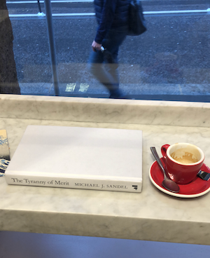

+++
title = "Reading Recommendations: Vol 1"
date = "2022-10-21"
publishdate = "2022-10-21"
slug = "reading-recs-vol-1"
draft = "false"
credits = ""
+++

Here are some books I've recently read. I'm on a non-fiction situation.

## Alegre, Susie. (2022) *Freedom to Think: The Long Struggle to Liberate Our Minds*

To paraphrase Shoshana Zuboff, this is book for those who wish to understand why they lack an offstage.

## Sandel, Michael J. (2020) *The Tyranny of Merit: What's Become of the Common Good?*

I was fortunate to hear Sandel speak. The compare said his skill was the *art of gentle persuasion*, and this book is a testament to that. I related to the *striving* aspect of meritocracy, and I have since reflected on how this shaped my educational experience.

## Toop, David. (1995) *Ocean of Sound: Aether Talk, Ambient Sound and Imaginary Worlds*

Loose vignettes exploring the origins of ambient and environmental music, a tangled thread that was a pleasure to pull. 

