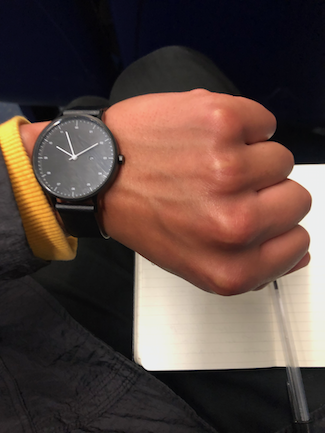

+++
title = "New Terrain: Portico Quartet Ensemble with Hannah Collins Live"
date = "2022-11-18"
publishdate = "2022-11-18"
slug = "portico-quartet-ensemble-hannah-collins-live-review"
draft = "false"
credits = ""
+++

## Portico Quartet Ensemble with Hannah Collins. The Barbican, London. Thursday 29th September 2022.

Second tier, top left, with a dear friend. 

My dear friend made the observation that for all the beauty in Collins' images, that we still need technology to understand them. 

The eye is drawn to the sheer variety that exists in nature, the colours, the shapes, it's curves. It is disturbed, however, by the clinical, precise and ugly modes we use to measure them.

My eyes were fixated on Duncan Bellamy's pulsating cymbal rhythms. A stray low tom hit hinted at a new development, only for Bellamy to stick rigidly to instruction for a considerably long time.

Jack Wyllie's saxophone ambiance reminds of passages on *Taphead* and *Eden* by Talk Talk. His long held notes echo into the ether, perhaps forming a bridge with Collins' images so they can meet and converse.

Less gorgeous was the bus home. Aching potholes and a teenager's visual feed provided an unsettling ambiance. I can feel the groan of the engine as I'm sat at the back, perhaps helping to absorb it's pain. The bumps in the terrain make me feel sick as I scribble these notes.