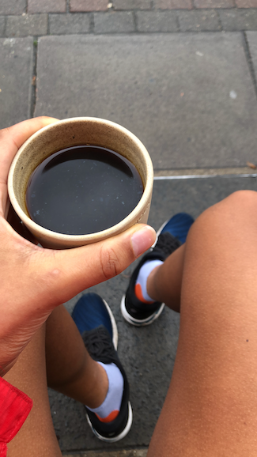

+++
title = "Visual Distractions: Max Cooper 3D/AV"
date = "2022-11-04"
publishdate = "2022-11-04"
slug = "visual-distractions-max-cooper-3d-av"
draft = "false"
credits = ""
+++

## Max Cooper: 3D/AV. Brixton Academy, London. Saturday 29th October 2022.

<!---->

Right of centre, up against the middle barrier. With dear friends, friends of friends, and acquaintances.

Assembled at Brixton Brewery, sat outside on two benches facing each other. Close quarters, knees touching. A nearby group experiences an early evening fatality: bench meets uneven pavement; man ends up decking it on the road.

Max Cooper, protected by netting, appears sheepishly after Nabihah Iqbal.

The most striking image - a grid of flashing numbers - reminded me of visions I had when I experienced [*sleep paralysis*](https://en.wikipedia.org/wiki/Sleep_paralysis). I started to wonder whether that was preferable to being in an audience who were either nattering incessantly or looking down. 

Occasionally, I would take a gander to see how the stunning visuals were captured on tiny lenses - it appeared like a totally different concert. Matters were not improved by a stray strike to the shoulder by a drunken punter, held back by his friends as his jelly legs were no match for the Brixton descent.

My dear friend said that one of images looked very [*Look North*](https://en.wikipedia.org/wiki/BBC_Look_North_(Yorkshire_and_North_Midlands)): a bridge with a motorway running underneath enclosed by Yorkshire-esque countryside. A silhouette emerged, and I remarked that I expected to see [*Harry Gration*](https://en.wikipedia.org/wiki/Harry_Gration).

I awoke the next morning. The numbers didn't haunt my dreams, but the close of summer meant it was an hour earlier than expected.

