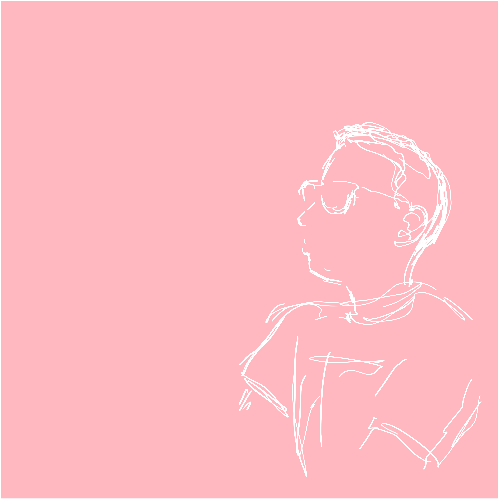

+++
title = "Pleased to Meet You EP"
date = "2023-04-21"
publishdate = "2023-04-21"
slug = "pleased-to-meet-you-ep"
draft = "false"
credits = ""
+++

I'm delighted to present [Pleased to Meet You EP](https://councilsofthefuture.bandcamp.com/album/pleased-to-meet-you-ep), a slice of minimal ambient music inspired by Hiroshi Yoshimura with a hint of *Selected Ambient Works* era Aphex Twin. 

It was written in moments of winter solitude whilst watching amateur golfers from my window.

Special thanks to [Rand Ghibril](https://www.instagram.com/i_think_therefore_i_overthink/) for the delightful sketch, and to Alex Hollingsworth at [Octagon London Studios](https://www.octagonlondon.com/) in Brixton for adding warmth.

I’d like to thank all the gardeners who helped water me - you know who you are.

Pleased to Meet You EP is out now on on [Bandcamp](https://councilsofthefuture.bandcamp.com/album/pleased-to-meet-you-ep), [Soundcloud](https://on.soundcloud.com/KcGQK), [Spotify](https://open.spotify.com/album/6sCnfSlR2bi2Br8wE7RcHl?si=fZsuDlMhSsiRB3Kk1kIgEA), [iTunes](https://music.apple.com/gb/album/pleased-to-meet-you-ep/1682932559) and [all good music stores](https://ditto.fm/pleased_to_meet_you).

Further listening:

* Aphex Twin - *Selected Ambient Works Volume II* (1994)
* Hiroshi Yoshimura - *Music for Nine Post Cards* (1982)

