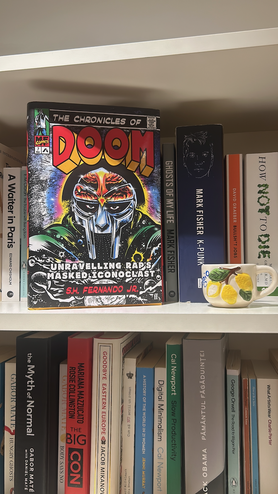

+++
title = "Patience with MF Doom"
date = "2025-07-19"
publishdate = "2025-07-19"
slug = "mf-doom-patience"
draft = "false"
credits = ""
+++

While traversing the hills of Transylvania, I had the perfect literary companion - a biography of MF DOOM by S.H. Fernando Jr.

What struck me is how DOOM seems to place emphasis on taking his time. In his words he made “a little bit of the beat and just let that play and walk away from it”.

I have often felt like I need to be in a rush, or to be part of the rush. However, what is becoming truer by the day is that **patience is a virtue**.

Further listening:

* MF Doom - *Operation: Doomsday* (199)
* Madvillain - *Madvillainy* (2004)
* MF DOOM - *Mm..Food* (2004)

